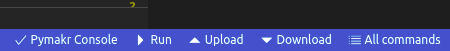

# Smartcube
Smartcube aims to be the IOT Cube anyone can **a**fford, **b**uild and **c**onfigure.

Smartcube is a physical die, which houses electronics to detect when the die is tilted and which side is facing up. It then triggers events over the internet via its wifi connection.

At the moment smartcube can be configured to
- track the time you work on your projects (Toogl)
- trigger any generic webhooks

# User Guide
Please find the user guide [here](https://flokain.github.io/Smart-Cube/)

# Project Goals
The Smartcube Project started as an exercise and personal challenge to deliver a polished OpenSource IOT product for real world applications that can be used by anyone, not just tinkers.

To accomplish this vision I set the following goals:

| Goal                                    | Description                                                                                                                                                                                                                          |
| --------------------------------------- | ------------------------------------------------------------------------------------------------------------------------------------------------------------------------------------------------------------------------------------ |
| Low cost                                | the costs for components and Material to build smartcube must be lower than 10€ in total on the regular market                                                                                                                       |
| power efficient                         | one battery charge for Smartcube lasts to detect 30 turns a day for 3 months (92 days).                                                                                                                                              |
| instructions for dummies                | At least one person has build this as his or her first IOT project. The Instructions to build and configure the smartcube are written with non technical users in mind to make sure anyone can build the Smartcube.                  |
| configuration for dummies               | At least one 50+yo nontechnical user has configured Smartcube by himself. a web interface guides through all configuuration steps                                                                                                    |
| 100% Automateable                       | Every configuration and every status can be configured via REST API.                                                                                                                                                                 |
| clean, extensible software architecture | At least one component was contributed by someone else. The architecture is simple and easy to understand. It encourages contributers to write and submit their own software components and find new applications for the Smartcube. |


# requirements

# Setup

# Testing
Smart Cube is tested in 2 ways.

# Unit Tests On Device
The python code depends on platform dependent libraries.
Because of this unittests must be executed on a device.
unittests a run on the device. connect via REPL
and execute
```
import unittest
unittest.main("unittests")
```
TODO: #10 seperate unittests that are device independent

# functional testing
Tests against the webAPI are ran against an operational device.
at the moment one has to change the host variable in tests/api_test.py
and then run from the project root dir TODO: #11 parse host as variable to tests 
```
pytest
```

# Rest API Reference
restapi is openapi conform:
https://app.swaggerhub.com/apis-docs/flokain/smartcube/v1
# Contribute

## Bug reports
## Feature requests

# Development
TODO
Developing for a microcontroller can be quite a challenge. The intention of this section is to provide a development environment that is as quickly as possible to setup and convenient as can be, requiring little to non knowledge of the microptython firmware building process for contributing.
If you choose to use your own environment feel free to use parts from mine and share ideas for making it better in an issue.
## setup development environment
The development environment looks like this:
Using VsCode you have code completion for micropython and the used thirdparty libraries installed by micropython-cli
via the pymakr vscode extension


1. Prerequesites
   1. install vscode
   2. install docker
   3. install git
   
2. clone repo with sumbodules, because we need to build our own firmware from the micropython repository

    ```bash
    git clone --recurse-submodules -j8 https://github.com/flokain/Smart-Cube
    ```

3. cd into the repository and run micropy.
   > :warning: This **command results in an error**, but it works until the point where the stubs for intellisense are installed. TODO: #15 fix json parse error when running micropy

    ```bash
    cd Smart-Cube
    micropy
    ```

4. start vscode in the repos root folder

    ```bash
    code .
    ```

5. [activate recommended vscode extensions](https://stackoverflow.com/questions/35929746/automatically-install-extensions-in-vs-code). TODO: #13 write how to activate all recommended extensions automatically
6. check at which path the device is mounted. `ls -la /dev/ttyUSB*` The default is /dev/ttyUSB0. If multiple are listed. try them out until one works ;)
If your device is not connected at /dev/ttyUSB0 set the SMART_CUBE_PATH environment variable with the correct path and change the pymakr.conf file 
    ```bash
    export SMART_CUBE_PATH=/dev/ttyUSB1
    sed -i 's@"address": .*@"address": "'$SMART_CUBE_PATH'",@g' pymakr.conf
    ```
now you can:
- [Build and deploy](#build-and-deploy) the firmware
- via pymakr (vscode command plalette or button in lower status bar) 
  -  connect to devices micropython cli REPL
  - upload files such as new scripts,
- use intellisense including device libraries like `machine` in the code base in `./src`

## Build And Deploy Firmware
the following script uses docker to build the firmware, which includes the `smartcube` module in `./src` and all dependencies from `requirements.txt`. It then deploys the Firmware on the device. This is neccesary to save ram. frozen sourcecode (=firmware) is directly accessed and not loaded in to ram. 

> :warning: Be sure to **set SMART_CUBE_PATH from [Setup Development Environment Step 6](#setup-development-environment)** if your device is **not connected at /dev/ttyUSB0**
and **disconnect REPL** (pymakr > disconnect) from the device. Otherwise Deployment will fail

```
 ./build_deploy.sh 
```
if for some reason this command crashes, try to clean the whole build, whipe the device flash and restart form scratch via
```
 ./clean_build_deploy.sh
```

The Firmware build ommits the boot and main scripts and other files, which are all under `./src` but not in `./src`
## Deploy scripts and static files
To deploy those use the vscode command palette: `pymakr > Upload Project` or the Upload button from the lower status bar 

afterwards the cube will reboot and launch in operational mode.
you can now go on an
- [run functional tests](#functional-testing) against the cube
- configure
- use

### Hardware Trigger

### core components


### pullrequest

# Support
# Development
project structure is created via [micropy-cli](https://github.com/BradenM/micropy-cli). 
Files from src are transfered to the microcontroller.